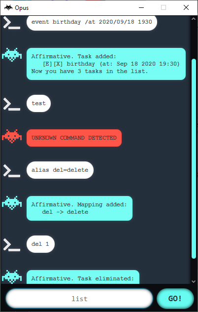

# Opus User Guide

Opus is a desktop application to simplify your task management needs.
Optimized for usage via a Command Line Interface (CLI) and augmented with a Graphical User Interface (GUI), 
Opus is fast and easy to use.

## Table of Contents
- [Requirements](#requirements)
- [Quick Start](#quick-start)
- [Features and Usage](#features-and-usage)

## Requirements

- Java 11 or later.

## Quick Start

1. Download opus.jar.
 
2. Copy the file to the folder you want to use as the home folder for Opus.
 
3. Double-click the file to start the app.
 
4. Type a command in the prompt box and press Enter to send it to Opus.
 
5. Refer to the [Features and Usage](#features-and-usage) section below for details of each command.

## Features and Usage

- Words in `UPPER_CASE` are parameters to be supplied by the user.
- Items in `[square brackets]` are optional.

### Add a task - `todo` / `deadline` / `event`

Adds a task with a specific type.

- `todo` - a task without a timestamp.  
    Format: `todo DESCRIPTION`  
    Example of usage: `todo draw more art`

- `deadline` - a task with a timestamp indicating by when it must be done.  
    Format: `deadline DESCRIPTION /by YYYY/MM/DD [HHMM]`  
    Example of usage:  
    - `deadline finish project /by 2020/09/18`
    - `deadline submit assigment /by 2020/10/03 2359`
- `event` - a task with a timestamp indicating when it will be held.  
    Format: `event DESCRIPTION /at YYYY/MM/DD [HHMM]`  
    Example of usage:  
    - `deadline CTF competition /at 2020/09/05`
    - `deadline birthday surprise /at 2020/07/19 2200`

### Mark task as done - `done`

Marks a task with the specified index as done.

Format: `done INDEX`

Example of usage: `done 1`

### Delete a task - `delete`

Deletes a task with the specified index.

Format: `delete INDEX`

Example of usage: `delete 1`

### List all tasks - `list`

Lists all tasks saved in Opus.

Format: `list`

Example of usage: `list`

### Find tasks - `find`

Lists all tasks whose description contains the specified keyword.

Format: `find KEYWORD`

Example of usage: `find work`

### Add command alias - `alias`

Adds a command alias with the specified keyword.

Format: `alias KEYWORD=COMMAND`

Example of usage: `alias del=delete`

### Quit Opus - `bye`

Quits the Opus application.

Format: `bye`

Example of usage: `bye`

## Credits

- [SE-EDU JavaFX Tutorial](https://se-education.org/guides/tutorials/javaFx.html).